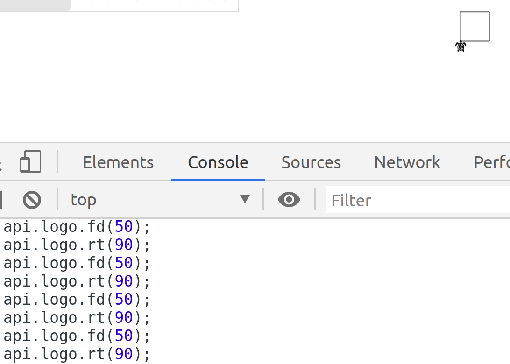

# Fun-with-blockly-workshop Mar-2020 FrontEnd guild 

#1) setup

* clone this repository 

`git clone https://bitbucket.outbrain.com/scm/feg/fun-with-blockly-workshop.git`
* enter the workshop directory

`cd fun-with-blockly-workshop`
* run npm install

`npm install` 
* run the build

`npm run build`
* and kick it off

`npm start` 

* see the results in http://localhost:9000/

#2) verify
* open http://localhost:9000/
* drag the `Hello World` block to the canvas
* fill in your name inside the block

* click on the button **Run your code**
* you sould see something like 

* take a screenshot and share in [#group-front-end-guild slack channel](https://app.slack.com/client/T0ADSDB25/CFE1TJFSB)
* now we know and you know, that you are ready !

#3) Logo
* JS basic api 
the api is an global object accessible on the page:
 
* `api.logo.fd(x)` move forward x (number) steps
* `api.logo.bk(x)` move back x (number) angles
* `api.logo.rt(x)` turn right x (number) angles
* `api.logo.lt(x)` turn left x (number) angles

* sample
The following code will draw a square

```javascript
api.logo.fd(50);
api.logo.rt(90);
api.logo.fd(50);
api.logo.rt(90);
api.logo.fd(50);
api.logo.rt(90);
api.logo.fd(50);
api.logo.rt(90);
```
* JS advanced api

