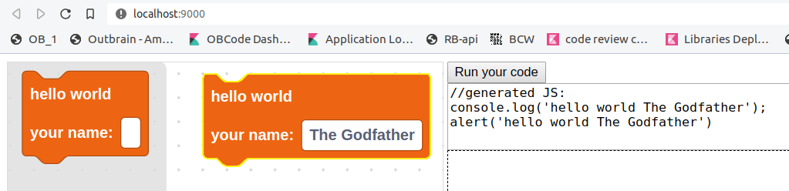

# Fun-with-blockly-workshop Mar-2020 FrontEnd guild 

# 1) setup

* clone this repository 

`git clone https://bitbucket.outbrain.com/scm/feg/fun-with-blockly-workshop.git`
* enter the workshop directory

`cd fun-with-blockly-workshop`
* run npm install

`npm install` 
* run the build

`npm run build`
* and kick it off

`npm start` 

* see the results in http://localhost:9000/

# 2) verify
* open http://localhost:9000/
* drag the `Hello World` block to the canvas
* fill in your name inside the block

* click on the button **Run your code**
* you sould see something like 

* take a screenshot and share in [#group-front-end-guild slack channel](https://app.slack.com/client/T0ADSDB25/CFE1TJFSB)
* now we know and you know, that you are ready !

# 3) creating custom Blockly blocks
* open `blockly-worksop-your-code.ts` 
* look on the `Hello World" implementation

* block definition is done like:
```javascript
Blocks['myBlock'] = {
    init: function() {..}
}
```

* the JS generator that stand behind the block is defined like this:
```javascript
JavaScript['myBlock'] = (block: any)=> {
    return "the-generate-JS-you-wish-to-have-as-string"
  }
```

* add your block to the toolBox this is done by updating the XML in `demo.ts`
```javascript
toolbox: `<xml xmlns="https://developers.google.com/blockly/xml" id="toolbox" style="display: none">
  <block type="helloWorld"/>
  <block type="myBlock"/>
</xml>`
``` 

### Blockly references
* [Blockly home page](https://developers.google.com/blockly/)
* [Blockly dev tool](https://blockly-demo.appspot.com/static/demos/blockfactory/index.html)

# 4) Logo
### JS basic api 
the api is an global object accessible on the page:
 
* `api.logo.fd(x)` move forward x (number) steps
* `api.logo.bk(x)` move back x (number) angles
* `api.logo.rt(x)` turn right x (number) angles
* `api.logo.lt(x)` turn left x (number) angles

### JS advanced api
* `api.logo.setAngle(x)` set angle to an absolute value of x (number)
* `api.logo.home()` send te turtle back home
* `api.logo.pu()` pen up (will move without drawing) 
* `api.logo.pd()` pen down 
* `api.logo.cs()` clear the screen and return back home
* `api.logol.setTurtle(x, y)` set position with absolute position x,y are numbers
* `api.logo.drawText(x)` draw text on the screen. x is string
* `api.log.st()` show the turtle
* `api.log.ht()` hide the turtle
* `api.log.dt()` draw a dot
* `api.logo.eraser()` switch from `pen` mode to `erase` mode
* `api.logo.pen` switch from `erase` mode to `pen` mode
* `api.logo.setScreenColor(x)` set background color to x (string). CSS format ('#FFFFFF' for white but also 'red' and rgb(1,2,3) works)
* `api.logo.setLineColor(x)` set the ling color to x (string). CSS format ('#FFFFFF' for white but also 'red' and rgb(1,2,3) works)


